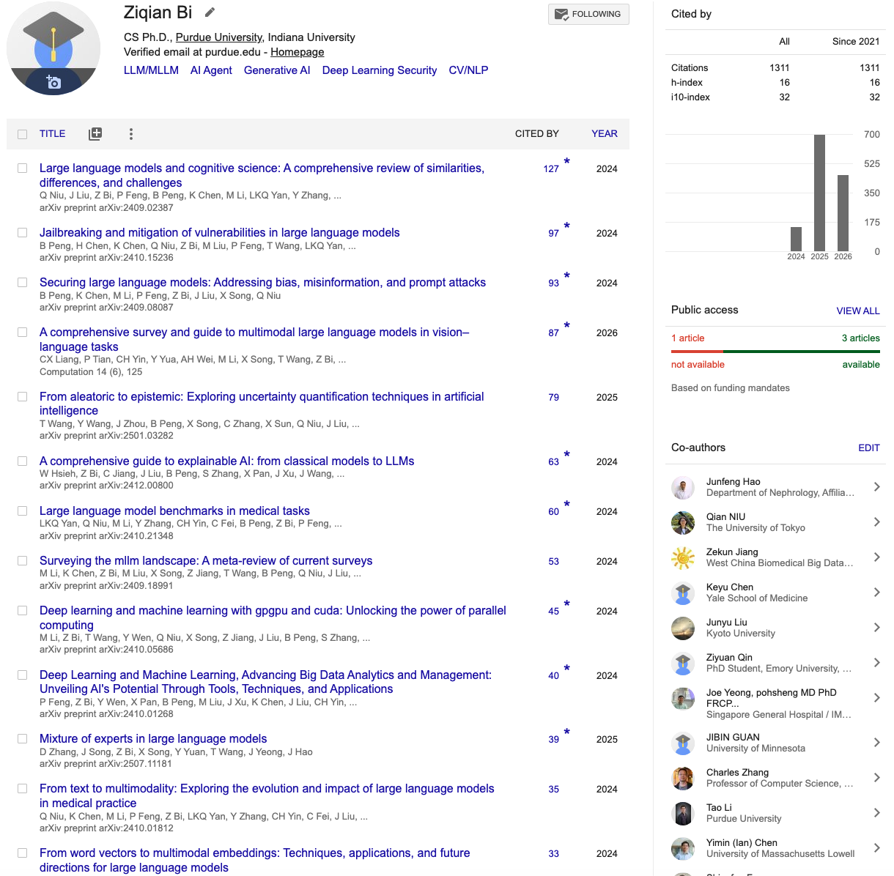
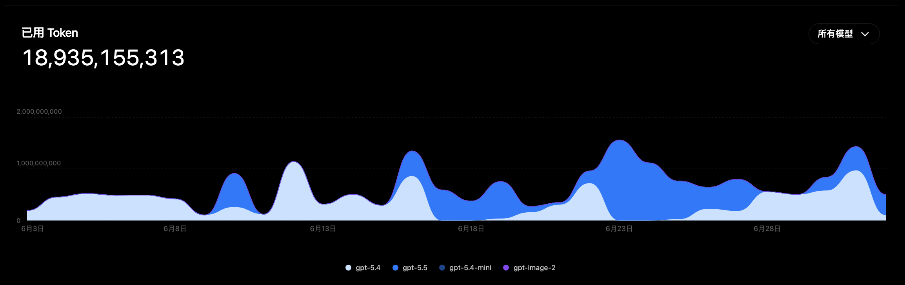
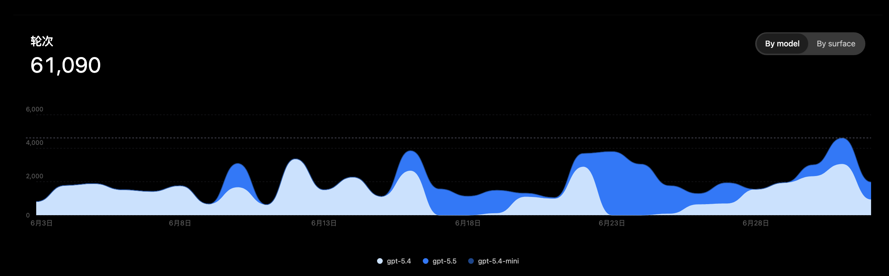
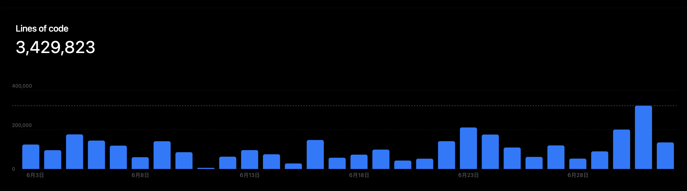
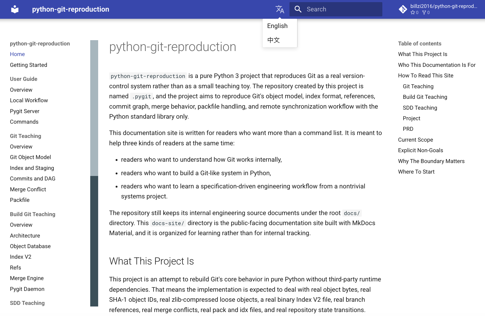
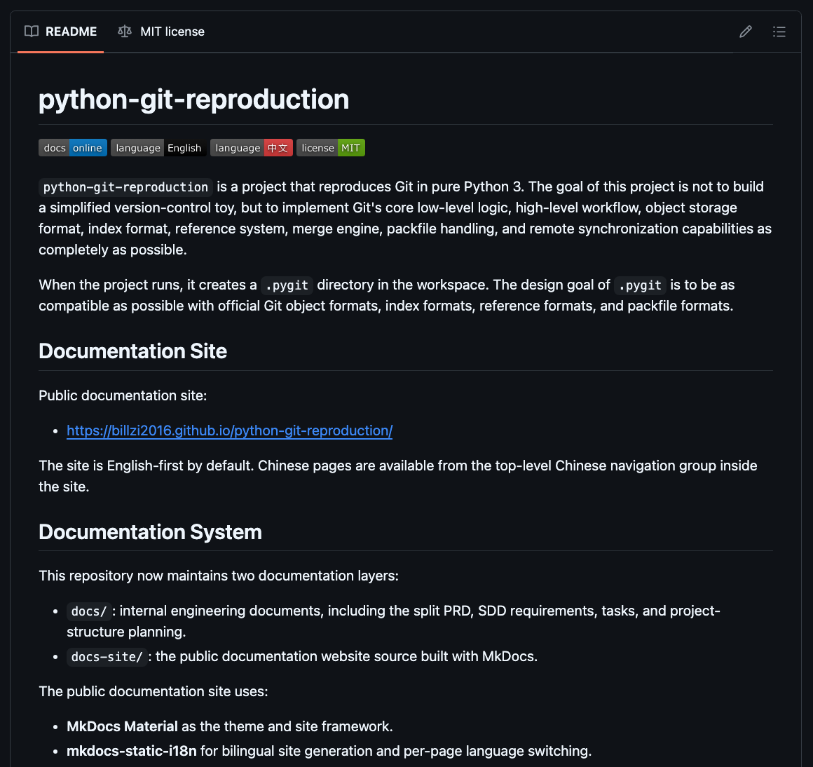
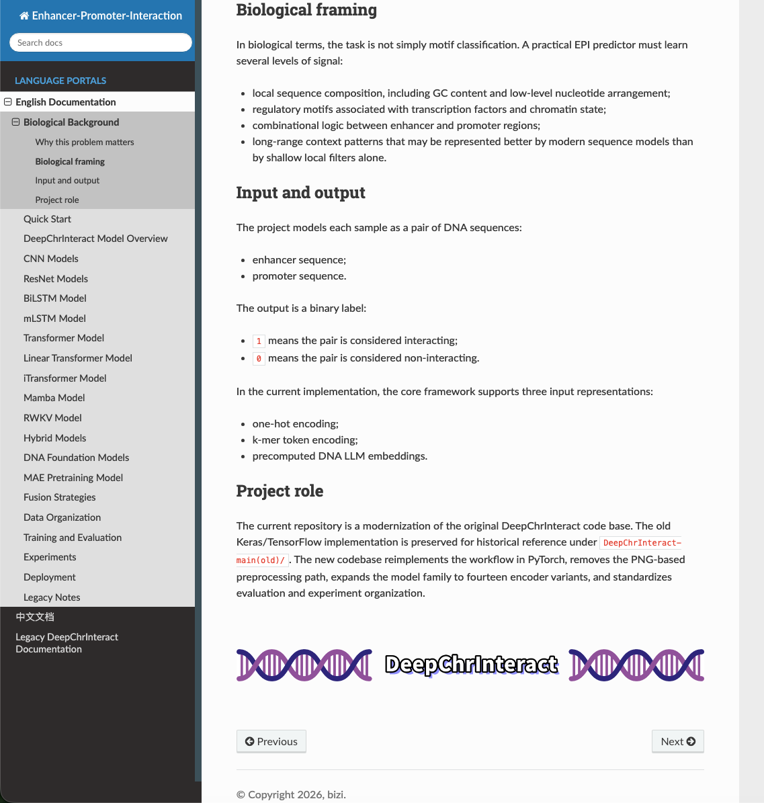
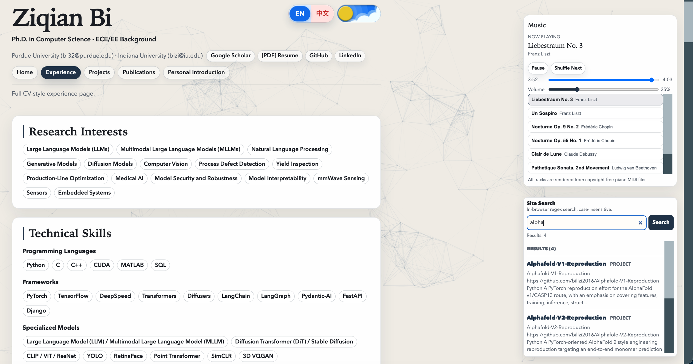
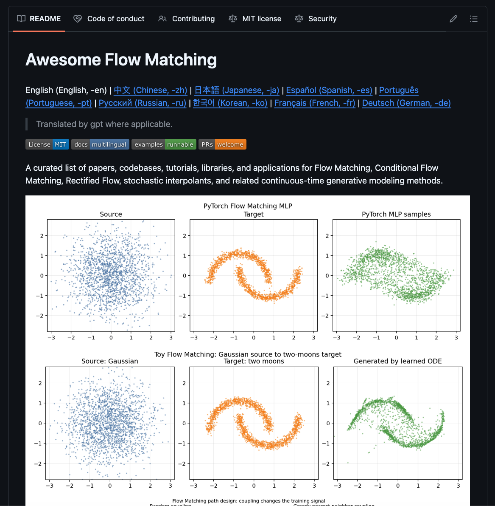

# Bill Zi

计算机科学博士，Purdue University / Indiana University  
LLMs/MLLMs | NLP 与 CV | GenAI | 工业与医疗 AI | XAI 与鲁棒性 | 毫米波与嵌入式

主要做编译器、LLM 系统、分布式实验平台、嵌入式原型，以及各种从零实现的工程项目。

个人主页：[billzi2016.github.io](https://billzi2016.github.io/)  
Google Scholar：[Ziqian Bi](https://scholar.google.com/citations?user=4z9m238AAAAJ&hl=en-US)

## 重点项目

<table>
<tr>
<td valign="top">

- [LLM-Benchmark-Studio](https://github.com/billzi2016/LLM-Benchmark-Studio)  
  本地优先的 LLM 评测平台，使用 Django、Vue、PostgreSQL、RabbitMQ、Celery 和 SSE 组织完整评测流程。

- [Build-DeepSeek-Step-by-Step](https://github.com/billzi2016/Build-DeepSeek-Step-by-Step)  
  从 tokenizer、attention、GQA、MLA、MoE 一路讲到训练与对齐的现代 LLM 拆解项目。

- [Apple-Silicon-LLM-Engine-from-Scratch](https://github.com/billzi2016/Apple-Silicon-LLM-Engine-from-Scratch)  
  面向 Apple Silicon 的 GPT-2 推理引擎，从 NumPy 版一路做到 PyTorch MPS 和 C++/Metal。

- [distributed-paxos-raft-lab](https://github.com/billzi2016/distributed-paxos-raft-lab)  
  Paxos / Raft 分布式共识实验平台，包含 FastAPI 节点模拟、Vue 控制面板和 Docker 集群编排。

- [GPU-Test-and-Polite-Scheduler](https://github.com/billzi2016/GPU-Test-and-Polite-Scheduler)  
  面向共享 GPU 服务器的实用工具，覆盖验卡、压测、多卡通信测试和礼貌型后台调度。

- [Leetcode-All-Languages-Best-Solutions](https://github.com/billzi2016/Leetcode-All-Languages-Best-Solutions) · [文档](https://billzi2016.github.io/Leetcode-All-Languages-Best-Solutions/)  
  多语言 LeetCode 最优解整理项目，按难度、题号区间和题目 slug 生成 Markdown，并配套 MkDocs 文档站。

</td>
<td valign="top">

- [automl-autodl](https://github.com/billzi2016/automl-autodl) · [文档](https://billzi2016.github.io/automl-autodl/)  
  面向 Home Credit 风险建模的表格 AutoML / AutoDL 工作区，包含共享预处理、传统机器学习、PyTorch 深度模型和文档页面。

- [C-Core-Compiler](https://github.com/billzi2016/C-Core-Compiler) · [文档](https://billzi2016.github.io/C-Core-Compiler/)  
  C-like 编译器项目，覆盖词法分析、语法分析、语义检查、IR、代码生成和文档页面。

- [python-git-reproduction](https://github.com/billzi2016/python-git-reproduction) · [文档](https://billzi2016.github.io/python-git-reproduction/)  
  Python 与 Git 可复现实验工作流文档项目，包含 MkDocs 页面和仓库级维护说明。

- [DeepChrInteract-v2](https://github.com/billzi2016/DeepChrInteract-v2) · [文档](https://billzi2016.github.io/DeepChrInteract-v2/)  
  面向染色质互作建模的深度学习项目，配套 Sphinx 文档站。

- [MIMO-FMCW-Radar-Simulator-Multiprocess](https://github.com/billzi2016/MIMO-FMCW-Radar-Simulator-Multiprocess) · [文档](https://billzi2016.github.io/MIMO-FMCW-Radar-Simulator-Multiprocess/)  
  多进程 MIMO FMCW 雷达仿真项目，配套公开文档页面。

- [mmwave-fmcw-cascade-mimo-sensing-platform](https://github.com/billzi2016/mmwave-fmcw-cascade-mimo-sensing-platform) · [文档](https://billzi2016.github.io/mmwave-fmcw-cascade-mimo-sensing-platform/)  
  毫米波 FMCW 级联 MIMO 感知平台，覆盖雷达信号处理和系统工作流文档。

- [mmlock-fmcw-radar-deep-security](https://github.com/billzi2016/mmlock-fmcw-radar-deep-security) · [文档](https://billzi2016.github.io/mmlock-fmcw-radar-deep-security/)  
  面向毫米波感知、认证与安全研究的 FMCW 雷达深度安全项目，采用文档驱动维护。

- [whisper-meeting-transcription-translation-and-summary](https://github.com/billzi2016/whisper-meeting-transcription-translation-and-summary) · [文档](https://billzi2016.github.io/whisper-meeting-transcription-translation-and-summary/)  
  基于 Whisper 的会议转写、翻译和摘要项目，预留 GitHub Pages 文档入口。

</td>
</tr>
</table>

## 系统、编译器与运行时

<table>
<tr>
<td valign="top">

- [C-Core-Compiler](https://github.com/billzi2016/C-Core-Compiler) · [文档](https://billzi2016.github.io/C-Core-Compiler/)
- [python-git-reproduction](https://github.com/billzi2016/python-git-reproduction) · [文档](https://billzi2016.github.io/python-git-reproduction/)
- [Self-Hosting-C-Core-Compiler](https://github.com/billzi2016/Self-Hosting-C-Core-Compiler)
- [Homemade-CPython](https://github.com/billzi2016/Homemade-CPython)
- [Homemade-Tiny-OS](https://github.com/billzi2016/Homemade-Tiny-OS)

</td>
<td valign="top">

- [Autograd-Compiler-Engine](https://github.com/billzi2016/Autograd-Compiler-Engine)
- [Automatic-Differentiation-From-Scratch](https://github.com/billzi2016/Automatic-Differentiation-From-Scratch)
- [bignum-from-scratch](https://github.com/billzi2016/bignum-from-scratch)

</td>
<td valign="top">

- [http-server-from--scratch](https://github.com/billzi2016/http-server-from--scratch)
- [Smart-Huffman-Archiver](https://github.com/billzi2016/Smart-Huffman-Archiver)
- [SQLite-Chaos-Tester](https://github.com/billzi2016/SQLite-Chaos-Tester)

</td>
</tr>
</table>

## LLM、Agent 与评测系统

<table>
<tr>
<td valign="top">

- [Industrial-Query-Agent](https://github.com/billzi2016/Industrial-Query-Agent)
- [Build-MCP-Step-by-Step](https://github.com/billzi2016/Build-MCP-Step-by-Step)
- [AI-Agent](https://github.com/billzi2016/AI-Agent)
- [ReAct-AI-Agent](https://github.com/billzi2016/ReAct-AI-Agent)

</td>
<td valign="top">

- [Pydantic-AI-Study](https://github.com/billzi2016/Pydantic-AI-Study)
- [ClinicaLLM-OmniBench](https://github.com/billzi2016/ClinicaLLM-OmniBench)
- [ClinicaLLM-OmniBench-EN](https://github.com/billzi2016/ClinicaLLM-OmniBench-EN)
- [LLM-SFT-PEFT-Preference-RL-Quantization-Inference-Deployment](https://github.com/billzi2016/LLM-SFT-PEFT-Preference-RL-Quantization-Inference-Deployment)

</td>
<td valign="top">

- [professional-agentic-learning](https://github.com/billzi2016/professional-agentic-learning)
- [Custom-Style-AI-Chat](https://github.com/billzi2016/Custom-Style-AI-Chat)
- [LLM-Gap-Tracker](https://github.com/billzi2016/LLM-Gap-Tracker)

</td>
</tr>
</table>

## 研究、数据与领域项目

<table>
<tr>
<td valign="top">

- [DeepChrInteract-v2](https://github.com/billzi2016/DeepChrInteract-v2) · [文档](https://billzi2016.github.io/DeepChrInteract-v2/)
- [ai-agentic-arxiv-observer](https://github.com/billzi2016/ai-agentic-arxiv-observer)
- [Daily-Paper-Reading](https://github.com/billzi2016/Daily-Paper-Reading)
- [LLM-AI-Papers](https://github.com/billzi2016/LLM-AI-Papers)

</td>
<td valign="top">

- [llm-auto-rag-survey](https://github.com/billzi2016/llm-auto-rag-survey)
- [Batch-MRI-Quality-Control](https://github.com/billzi2016/Batch-MRI-Quality-Control)
- [MRI_Deep_Learning_Projects](https://github.com/billzi2016/MRI_Deep_Learning_Projects)

</td>
<td valign="top">

- [Alphafold-V2-Reproduction](https://github.com/billzi2016/Alphafold-V2-Reproduction)
- [Alphafold-V1-Reproduction](https://github.com/billzi2016/Alphafold-V1-Reproduction)
- [ViT-H](https://github.com/billzi2016/ViT-H)

</td>
</tr>
</table>

## 基础设施、观测与工程工具

<table>
<tr>
<td valign="top">

- [NodeExporter-Prometheus-Grafana](https://github.com/billzi2016/NodeExporter-Prometheus-Grafana)
- [Apple-Silicon-Profiler](https://github.com/billzi2016/Apple-Silicon-Profiler)
- [system-burner](https://github.com/billzi2016/system-burner)

</td>
<td valign="top">

- [ESP8266-Codex-Usage-Monitor](https://github.com/billzi2016/ESP8266-Codex-Usage-Monitor)
- [ESP8266-Token-Counter](https://github.com/billzi2016/ESP8266-Token-Counter)
- [ESP32-Prometheus-PC-Monitor](https://github.com/billzi2016/ESP32-Prometheus-PC-Monitor)

</td>
<td valign="top">

- [system-design-interview](https://github.com/billzi2016/system-design-interview)
- [codex-config](https://github.com/billzi2016/codex-config)

</td>
</tr>
</table>

## 嵌入式、硬件与边缘系统

<table>
<tr>
<td valign="top">

- [ATmega2560-Graphical-RPN-Scientific-Calculator](https://github.com/billzi2016/ATmega2560-Graphical-RPN-Scientific-Calculator)
- [ATMega328p-RPN-Scientific-Calculator](https://github.com/billzi2016/ATMega328p-RPN-Scientific-Calculator)
- [ATmega2560-LCD12864-Game-Of-Life](https://github.com/billzi2016/ATmega2560-LCD12864-Game-Of-Life)
- [LCD12864-Bad-Apple](https://github.com/billzi2016/LCD12864-Bad-Apple)

</td>
<td valign="top">

- [LCD12864-Dither-TV](https://github.com/billzi2016/LCD12864-Dither-TV)
- [Arduino-Wired-Telegraph](https://github.com/billzi2016/Arduino-Wired-Telegraph)
- [ESP32-Weather-Box](https://github.com/billzi2016/ESP32-Weather-Box)

</td>
<td valign="top">

- [intelligent-esp32-drone-racing-gate-system](https://github.com/billzi2016/intelligent-esp32-drone-racing-gate-system)
- [MCU-Design-and-Prototypes-Sandbox](https://github.com/billzi2016/MCU-Design-and-Prototypes-Sandbox)
- [RS485-Modbus-Concrete-Sensor-Monitor](https://github.com/billzi2016/RS485-Modbus-Concrete-Sensor-Monitor)

</td>
</tr>
</table>

## 算法、搜索与博弈 AI

<table>
<tr>
<td valign="top">

- [gomoku-terminator](https://github.com/billzi2016/gomoku-terminator)
- [RL-MCTS-gomoku-zero-11x11](https://github.com/billzi2016/RL-MCTS-gomoku-zero-11x11)
- [gomoku-minimax-engine](https://github.com/billzi2016/gomoku-minimax-engine)

</td>
<td valign="top">

- [reversi-mcts-rl-zero](https://github.com/billzi2016/reversi-mcts-rl-zero)
- [reversi-minimax-alphabeta](https://github.com/billzi2016/reversi-minimax-alphabeta)
- [2048-expectimax-bitboard](https://github.com/billzi2016/2048-expectimax-bitboard)

</td>
<td valign="top">

- [python-tetris-ai](https://github.com/billzi2016/python-tetris-ai)
- [openai-gym-reinforcement-learning-lab](https://github.com/billzi2016/openai-gym-reinforcement-learning-lab)
- [inverted-pendulum-rl-lab](https://github.com/billzi2016/inverted-pendulum-rl-lab)
- [Metropolitan-Routing-Algorithm](https://github.com/billzi2016/Metropolitan-Routing-Algorithm)

</td>
</tr>
</table>

## 练习与学习型仓库

<table>
<tr>
<td valign="top">

- [whitebox-ml-dl-algo](https://github.com/billzi2016/whitebox-ml-dl-algo)
- [advanced-search-data-structures](https://github.com/billzi2016/advanced-search-data-structures)
- [advanced-sorting-algorithms](https://github.com/billzi2016/advanced-sorting-algorithms)

</td>
<td valign="top">

- [Prime-Sieve-Algorithms](https://github.com/billzi2016/Prime-Sieve-Algorithms)
- [Heuristic-Algorithm](https://github.com/billzi2016/Heuristic-Algorithm)
- [Daily-Leetcode](https://github.com/billzi2016/Daily-Leetcode)

</td>
<td valign="top">

- [leetcode-terminator](https://github.com/billzi2016/leetcode-terminator)
- [Study](https://github.com/billzi2016/Study)

</td>
</tr>
</table>

## 其他项目

<table>
<tr>
<td valign="top">

- [MIMO-FMCW-Radar-Simulator-Multiprocess](https://github.com/billzi2016/MIMO-FMCW-Radar-Simulator-Multiprocess) · [文档](https://billzi2016.github.io/MIMO-FMCW-Radar-Simulator-Multiprocess/)
- [mmwave-fmcw-cascade-mimo-sensing-platform](https://github.com/billzi2016/mmwave-fmcw-cascade-mimo-sensing-platform) · [文档](https://billzi2016.github.io/mmwave-fmcw-cascade-mimo-sensing-platform/)
- [mmlock-fmcw-radar-deep-security](https://github.com/billzi2016/mmlock-fmcw-radar-deep-security) · [文档](https://billzi2016.github.io/mmlock-fmcw-radar-deep-security/)
- [billzi2016.github.io](https://github.com/billzi2016/billzi2016.github.io)

</td>
<td valign="top">

- [vlm-hybrid-gallery](https://github.com/billzi2016/vlm-hybrid-gallery)
- [Whisper](https://github.com/billzi2016/Whisper)
- [real-time-yolo-vision-intelligence-lab](https://github.com/billzi2016/real-time-yolo-vision-intelligence-lab)

</td>
<td valign="top">

- [chaos-algorithms](https://github.com/billzi2016/chaos-algorithms)
- [Four-Color-Theorem](https://github.com/billzi2016/Four-Color-Theorem)
- [DTMF-Encod-Decode](https://github.com/billzi2016/DTMF-Encod-Decode)

</td>
</tr>
</table>

## 学术主页

[Google Scholar 主页](https://scholar.google.com/citations?user=4z9m238AAAAJ&hl=en-US)

## 最近的 GitHub Pages 维护

最近我一直在重构和打磨自己的 GitHub Pages，并在 Human-in-the-Loop 的工作流中重度使用 Codex / Claude Code，把不少老仓库逐步整理成更正规、更完整、更易读、也更容易导航的项目站点。下面这些截图记录了过去一个月的使用情况和维护状态。

这项工作并不是为了盲目生成页面，而是按照 Spec-First、Review-Driven 的方式推进，并持续引入测试驱动开发（Test-Driven Development, TDD）、规格驱动开发（Spec-Driven Development, SDD）和持续集成 / 持续交付（Continuous Integration / Continuous Delivery, CI/CD）等工程实践，去提升这些历史项目的可读性、多平台支持能力、可维护性、后续维护效率、安全性和稳定性。AI 辅助极大提升了整体整理和重构速度，而在面对数量众多、相互关联的文档时，AI 也天然更擅长做结构梳理、术语统一和跨文档联动修订，从而减少“这一处改了、另一处没跟上”的问题。与此同时，项目取舍、内容验收、结构收敛以及最终编辑控制始终保持 Human-in-the-Loop，以对 AI 幻觉形成严格抑制，避免未经验证的信息进入最终内容。

这里汇总的截图记录了过去一个月的使用情况，也集中展示了面向外部的文档站、仓库呈现方式和项目入口，让读者即使不在本地运行项目，也能先理解项目的结构、状态和预期用途。当前这一轮整理，主要在往三种文档形态收敛：基于 MkDocs 的文档站、基于 Sphinx 的文档站，以及直接使用 HTML、CSS、JavaScript 构建的原生静态站。

跨模型 token 消耗

按模型统计的对话轮次

累计生成代码行数

MkDocs 文档站与仓库 README / 文档系统示例：python-git-reproduction

- 页面链接：[https://billzi2016.github.io/python-git-reproduction/](https://billzi2016.github.io/python-git-reproduction/)
- 仓库链接：[https://github.com/billzi2016/python-git-reproduction](https://github.com/billzi2016/python-git-reproduction)

Sphinx 文档站：DeepChrInteract-v2

- 页面链接：[https://billzi2016.github.io/DeepChrInteract-v2/](https://billzi2016.github.io/DeepChrInteract-v2/)
- 仓库链接：[https://github.com/billzi2016/DeepChrInteract-v2](https://github.com/billzi2016/DeepChrInteract-v2)

原生静态站：billzi2016.github.io

- 页面链接：[https://billzi2016.github.io/](https://billzi2016.github.io/)
- 仓库链接：[https://github.com/billzi2016/billzi2016.github.io](https://github.com/billzi2016/billzi2016.github.io)

整理型项目 README 示例：Awesome Flow Matching

- 仓库链接：[https://github.com/billzi2016/awesome-flow-matching](https://github.com/billzi2016/awesome-flow-matching)

